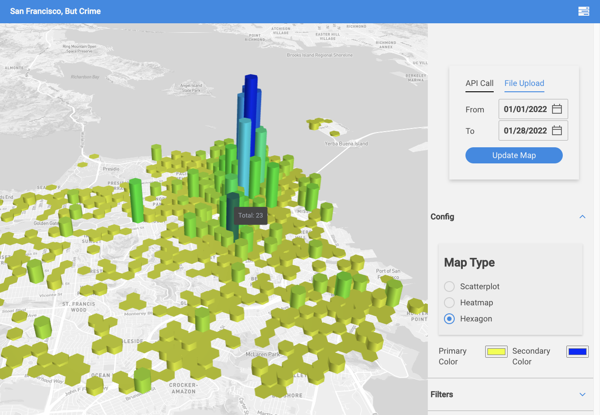
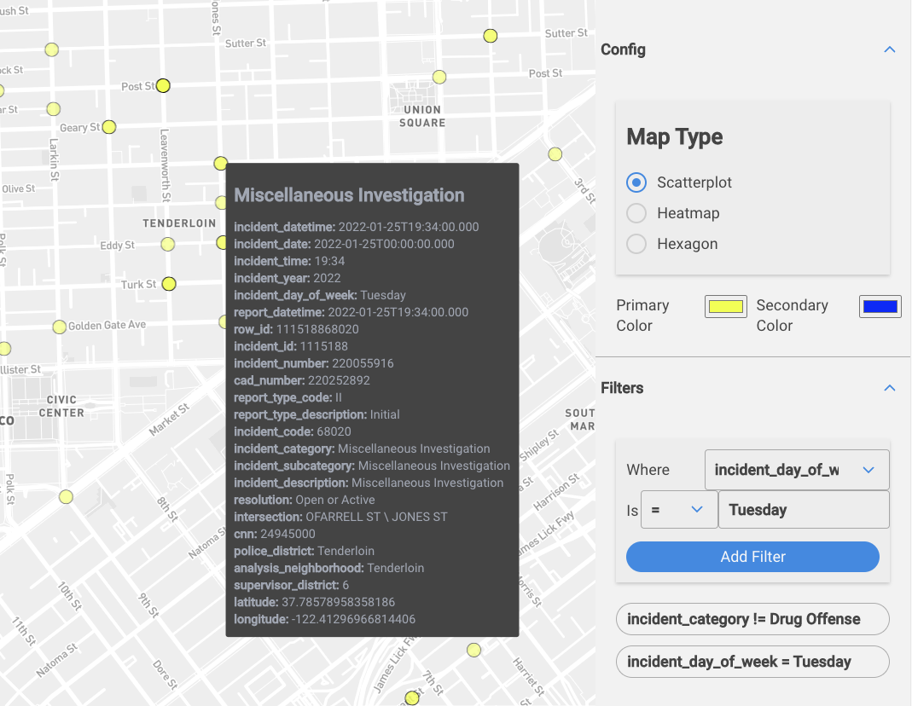

# San Francisco, But Crime
This is my crack at LiveEarth's coding takehome. A live version of the website is available [here](https://liveearth-kevin-homework.netlify.app/).  

## Gallery
### You'll have a hex of a time with hexagons!

### Investigate those miscellaneous details with a closer look! Filters!

### Colorful charts and maps are fun for the whole family!

## Retrospective

#### Things I Liked
- React hooks are awesome! It's been a while since I've touched the JS ecosystem and despite hooks being foregin at first, I found it to be a very enjoyable programming experience.
- I quite like using Nivo, and find it to be a very polished dataviz library.
- Jesse popped in a few times and explained some distilled patterns like using `react-query` in lieu of calling APIs in `useEffect()`. Very insightful.
- San Francisco's Government has some fascinating data sources on Socrata.

#### Things I Didn't Like
- I ran into a few instances where I would write something like `dataset.filter` when I needed to actually use `dataset.filters`. I would consequently spend the next 15 minutes hunting down the problem when TypeScript would've made it a non-issue.
- Similarly, accidentally omitting braces or writing a React Component as `({prop1}, {prop2}) => ...` instead of `({prop1, prop2}) => ...` would lead to an excessively long hair-loss session. D'oh.
- I used [Grommet](https://v2.grommet.io/) for my component and styling needs, and I struggled getting things looking _just right_. I'm not satisfied with how things in the sidebar look, and I felt that there wasn't enough examples/documentation/etc. to solve my issues without spending an inordinate amount of time. 

#### Action Items If I Redid The Project
- Debugger debugger debugger.
- Take a moment and learn TypeScript, and then use TypeScript.
- Vet the ecosystem of my prefab component framework-of-choice for more than just 10 seconds.
- Use memoize, have a more centralized theming, and debounce `onChange()` events like the color picker.

## Steps

### Cloning
`git clone https://github.com/kevinxtung/LiveEarthTakehome.git`

### Installation
`yarn install`

### Building
`yarn build`

### Starting
`yarn start`

## Bottom of the README

